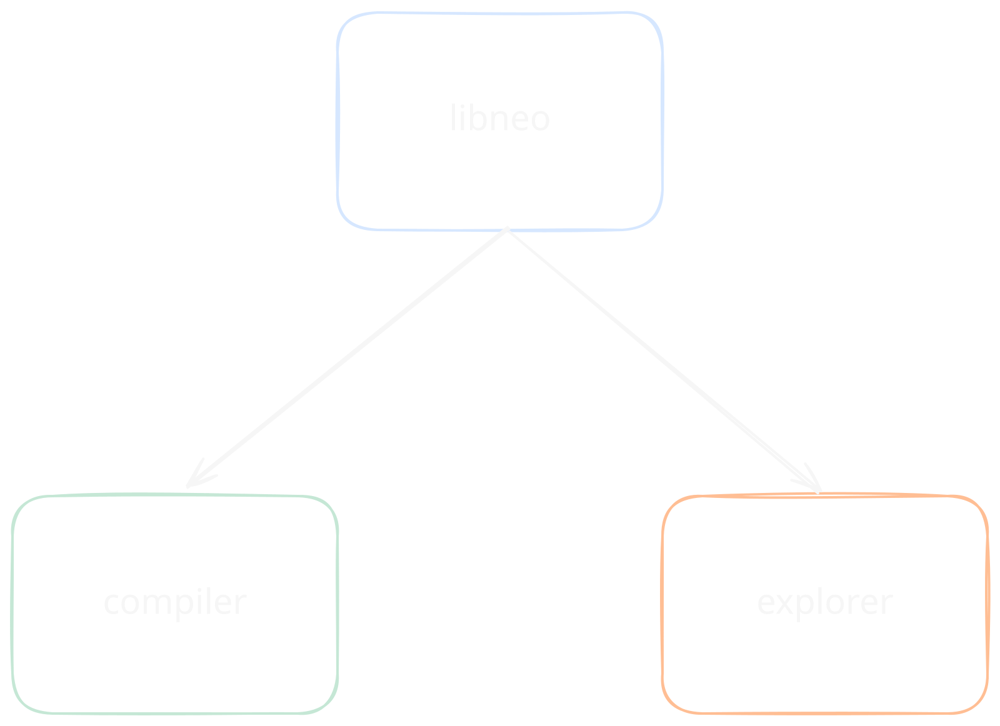

# Project Briefing
## Goals
- [ ] Implement a subset of the Neo language spec in libneo.
- [ ] Compile libneo as a shared, static, or wasm library to be used across platforms.
- [ ] Create an interactive web explorer that utilizes the wasm flavor of libneo and visually showcases the different stages of the neo compilation pipeline in real time.
- [ ]  Create a traditional cli compiler that utilizes native libneo.


# Toolchain Spec w/ graphics

# Language Spec

```ts
std :: #import "std"

Foo :: #import "Foo.neo"

main : fn : {
	Foo.init()
}
```
```ts Foo.neo

x : u8,
y : u8,

init : fn (n: u8) #Self : .{ .x = n, .y = n }

```